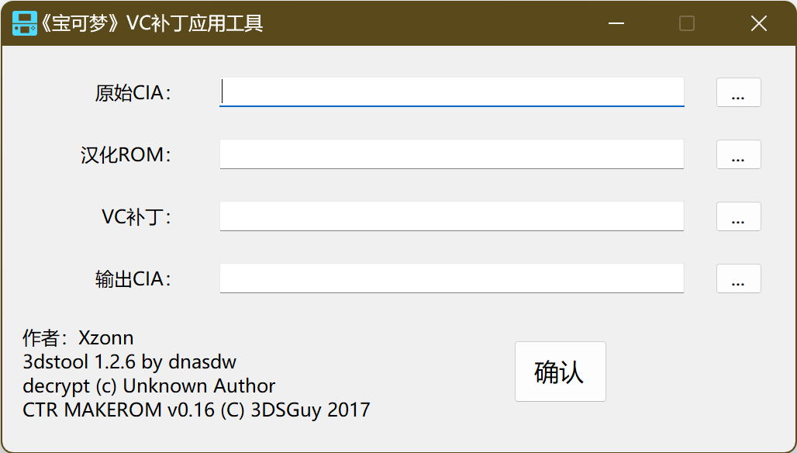

# 《宝可梦》VC补丁应用工具
## 基本说明
本项目可对 Nintendo 3DS Virtual Console 平台的《宝可梦》游戏的 cia 文件应用补丁，从而使其能够使用连接交换等通信功能；也可将 cia 文件中的游戏替换为其他游戏的 ROM。

本项目首先将 cia 解包，然后将 romfs 中的 ROM 文件替换为给定的 ROM，并将补丁加入 romfs 中，再将文件打包回 cia。

官方发售的 VC 游戏本身就包含了应用于原版 ROM 的通信补丁，而汉化版游戏大多基于原版 ROM 制作，因此基本可以直接用汉化版 ROM 替换原版 ROM 实现通信功能；而 CKN&DMG&口袋群星SP 汉化的《宝可梦 水晶版》基于原作的反编译版本修改，部分地址有所变动，因此需要重新编译通信补丁并替换原有补丁。

## 用法
请在 [Release](https://github.com/Xzonn/Pokemon3DSVCPatch/releases/latest) 页面获取本工具的最新编译版本。

需要准备：

- 原始 CIA：即官方 Vitrual Console 游戏的 cia 文件。如何获取 cia 文件不在本项目的研究范围内。建议 cia 文件中包含的游戏与需要替换的游戏 ROM 一致。例如前述《宝可梦 水晶版》汉化基于英文版，则建议使用[《Pokémon Crystal Version》](https://www.nintendo.com/store/products/pokemon-crystal-version-3ds/)的 cia 文件，其 Title ID 为`0004000000172800`。其他 VC 游戏的 Title ID 可在 [此网站](https://hshop.erista.me/search) 进行查询。
- 汉化 ROM：即需要替换成的游戏 ROM，例如汉化版 ROM。
- VC 补丁：对于前述《宝可梦 水晶版》汉化版本，需要在 [Release](https://github.com/Xzonn/Pokemon3DSVCPatch/releases/latest) 页面下载“`Pokemon_Crystal.patch`”并选择该文件。对于其他游戏，若 cia 文件中包含的游戏与需要替换的游戏 ROM 一致，则无需选择，该 cia 文件中已经包含了官方补丁。
- 输出 CIA：即本工具生成的 cia 文件。

## 致谢
本项目包含了以下项目的编译版本：
- [3dstool](https://github.com/dnasdw/3dstool)（作者：[dnasdw](https://github.com/dnasdw)）
- decrypt（作者不详）
- [makerom](https://github.com/3DSGuy/Project_CTR/tree/master/makerom)（作者：[3DSGuy](3DSGuy)）

《宝可梦 水晶版》汉化版VC补丁基于以下代码：
- [pokecrystal](https://github.com/pret/pokecrystal)（作者：[pret](https://github.com/pret)）
- [pokecrystal_cn](https://github.com/SnDream/pokecrystal_cn)、[pokecrystal_cn_build](https://github.com/SnDream/pokecrystal_cn_build)（作者：[SnDream](https://github.com/SnDream)、CKN&DMG&口袋群星SP）